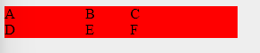

# [Aprende Javascript ES9, HTML, CSS3 y NodeJS desde cero](https://www.udemy.com/course/aprende-javascript-es9-html-css3-y-nodejs-desde-cero/learn/lecture/19243410)

# Índice

1. **Introducción.**
2. **HTML básico.**
3. **HTML: formularios**
4. **Imágenes, links, listas y tablas**
5. **Ejercicios**
6. **CSS**
7. **CSS: modelo de caja**
8. **CSS: Texto**
9. **CSS: Link, listas y tablas**
10. **CSS: Display, max-width, position, overflow, float y + selectores**
11. **CSS: Elementos útiles**
12. **CSS: Avanzado**
13. **CSS: Grid**

# Contenido
## 1. **Introducción.**
## 2. **HTML básico.**
## 3. **HTML: formularios**
## 4. **Imágenes, links, listas y tablas**
## 5. **Ejercicios**
## 6. **CSS**
Se recomienda cargar el CSS dentro del **\<head\>**.
Se carga de varias formas:
- Con un fichero externo
```html
<head>
    <title>Título</title>
    <link rel="stylesheet" href="main.css" type="text/css">
</head>
```
- Internamente (definido debajo de \<head\> utilizando la etiqueta **\<style\>**)
```html
<head>
    <title>Título</title>
    <style>
        body {
            font-family: Arial, sans-serif;
            background-color: #f0f0f0;
            margin: 0;
            padding: 0;
        }
    </style>
</head>
```
- Internamente (embebido en el HTML)
```html
<div style="background-color:red; color:white">Hola Mundo!</div>
```
## 7. **CSS: modelo de caja**
## 8. **CSS: Texto**
## 9. **CSS: Link, listas y tablas**
## 10. **CSS: Display, max-width, position, overflow, float y + selectores**
## 11. **CSS: Elementos útiles**
## 12. **CSS: Avanzado**
## 13. **CSS: Grid**
Cuando se define un *grid*, por defecto, lo interpreta como una sola columna, con diferentes filas.

La propiedad *grid* puede ser:
- **grid**: utiliza todo el ancho de la grilla.
- **inline-grid**: solamente utiliza el espacio definido en sus elementos. Será igual de ancho como el elemento más ancho dentro de la *grilla*.

Cuando se utiliza **grid-template-rows** se define la altura que va a tener cada fila. Si existen 3 filas, y se ponen dos definiciones, aplica a las dos primeras. En el siguiente ejemplo, si tenemos 3 filas, solo se aplicaría a las dos primeras.
```css
.grid {
    display: grid;
    grid-template-rows: 50px 100px;
}
```

Si se utiliza **grid-template-columns** y se tienen 6 elementos, pero se añaden 3 medidas, dividiría los elementos en 3 columnas y 2 filas.

```html
<div class="grid">
    <div class="element">A</div>
    <div class="element">B</div>
    <div class="element">C</div>
    <div class="element">D</div>
    <div class="element">E</div>
    <div class="element">F</div>
</div>
```
```css
.grid {
    display: grid;
    grid-template-columns: 90px 50px 120px; /* Valor: píxel */
    grid-template-columns: 1fr 2fr 3fr; /* Valor: fracciones */
    grid-template-columns: 2rem 20% 1fr 2fr; /* Se pueden mezclar valores*/
}
```


A **grid-template-rows** se le puede asignar un tamaño **mínimo** y **máximo** utilizando **minmax(<ancho>, auto)**

```css
.grid {
    display: grid;
    grid-template-rows: minmax(100px auto);
    grid-template-columns: minmax(auto, 50%) 1fr 3em;
}
```
